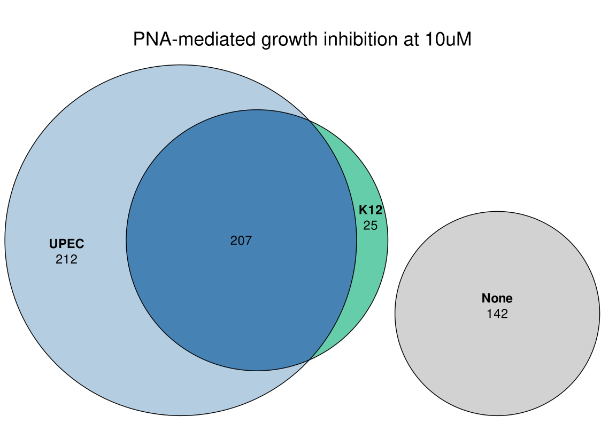

# Machine-learning to predict the MIC of UPEC 

- Name of project: Machine-learning to predict the MIC of UPEC

- Data analysis /algorithm development: Jakob Jung
- Experiments: Linda Popella, Phuong Thao Do, Barbara Plaschke
- Supervision: Jörg Vogel, Lars Barquist
- Start: 2023


## Introduction

This repository describes the data analysis and machine learning model building, in order to predict a PNA's MIC based on sequence- and gene-specific attributes. The input data was generated using the protocol visualized below, measuring MIC for PNAs designed to target the entire essential genome of *E. coli* K12 and UPEC str. 536. 


## Directory structure

The project is divided in 3 main directories:

-   [data](data) : contains all raw, intermediate and final data of the project.  
-   [analysis](analysis): contains analysis files, such as figures, plots, tables, etc. 
-   [scripts](scripts): contains scripts to process and analyze data from the data directory.

Some directories have their own README.md file with information on the respective files. 


## Workflow

Here I describe the workflow, which can be followed to fully reproduce the results.


### 1. Prerequisites

For running the whole analysis, one needs following packages/tools/software:

- R  v.4.3.1 along with packages from Bioconductor/CRAN (see [scripts](scripts))

- Linux shell (we used Ubuntu 20.04.6 LTS) for commands & bash scripts

- RNAfold v.2.4.14

- [MASON](https://github.com/BarquistLab/mason_commandline) command line (v1.0.1)

- EMBOSS v.6.6.0.0

- ...


### 2. Raw data & preliminary data curation

#### 2.1. Raw data

The raw data consists of 

- a table with the PNAs that were designed (sequence, ID, etc.): [/data/PNAscreening_Ecoli_MIC.xlsx](./data/PNAscreening_Ecoli_MIC.xlsx)
- a fasta file including all PNA sequences of fasta: [data/reference_sequences/pna_sequences.fasta](data/reference_sequences/pna_sequences.fasta)
- the reference sequences of UPEC 536: [data/reference_sequences/ecoli536.fasta](data/reference_sequences/ecoli536.fasta) , [data/reference_sequences/ecoli536_sRNAs.gff3](data/reference_sequences/ecoli536_sRNAs.gff3) 
- the reference sequences of K12: [data/reference_sequences/e_coli_K12.fasta](data/reference_sequences/e_coli_K12.fasta), [data/reference_sequences/e_coli_K12.gff3](data/reference_sequences/e_coli_K12.gff3)
- the raw growth data for K12 and UPEC can be found in [data/raw_growth_data](data/raw_growth_data)
- 


#### 2.2. Off-target predictions using MASON 

Some predictors had to be created preliminary from the PNA sequences. For example, the [MASON command line tool](https://github.com/BarquistLab/mason_commandline) was used to generate off-target predictions (in *E. coli* K12), Tm predictions etc.  To do this, the mason command line tool needs to be installed, and following code was run for K12: 

```bash
sh mason.sh  -f data/reference_sequences/e_coli_K12.fasta -g data/reference_sequences/e_coli_K12.gff3 -m 2 -i K12_ESSSCREEN_2mm -p ~/Documents/UPEC_K12_essgenes_2023_03/data/reference_sequences/pna_sequences.fasta

sh mason.sh  -f data/reference_sequences/e_coli_K12.fasta -g data/reference_sequences/e_coli_K12.gff3 -m 1 -i K12_ESSSCREEN_1mm -p ~/Documents/UPEC_K12_essgenes_2023_03/data/reference_sequences/pna_sequences.fasta

sh mason.sh  -f data/reference_sequences/e_coli_K12.fasta -g data/reference_sequences/e_coli_K12.gff3 -m 0 -i K12_ESSSCREEN_0mm -p ~/Documents/UPEC_K12_essgenes_2023_03/data/reference_sequences/pna_sequences.fasta
```

And the same for UPEC:

```bash
sh mason.sh  -f data/reference_sequences/ecoli536.fasta -g data/reference_sequences/ecoli536_sRNAs.gff3 -m 0 -i UPEC_ESSSCREEN_0mm -p data/reference_sequences/pna_sequences.fasta 

sh mason.sh  -f data/reference_sequences/ecoli536.fasta -g data/reference_sequences/ecoli536_sRNAs.gff3 -m 1 -i UPEC_ESSSCREEN_1mm -p data/reference_sequences/pna_sequences.fasta 

sh mason.sh  -f data/reference_sequences/ecoli536.fasta -g data/reference_sequences/ecoli536_sRNAs.gff3 -m 1 -i UPEC_ESSSCREEN_1mm -p data/reference_sequences/pna_sequences.fasta 
```

The resulting result tables were copied into the directory [data/MASON_output](data/MASON_output)  (called result_table_2mm.csv, etc.)  and are processed in the R scripts


#### 2.3. RNA folding prediction in target mRNA

To calculate the folding of the mRNA around the target genes' translation initiation region (TIR), i.e. the region +- 30 nt around the start codon. The exact commands can be found in [data/sec_structure_rnafold/README.md](data/sec_structure_rnafold/README.md). 


#### 2.4. mRNA decay

*E. coli* mRNA decay data from [Esquerre et al.](https://bmcgenomics.biomedcentral.com/articles/10.1186/s12864-015-1482-8) has been downloaded and added to the directory [data/mRNA_decay](data/mRNA_decay).


#### 2.5. gene essentiality data

E. coli fitness data from https://www.sciencedirect.com/science/article/pii/S2405471220303665?via%3Dihub and https://journals.asm.org/doi/full/10.1128/mbio.02561-21 were deposited in [data/gene_essentiality](data/gene_essentiality)


#### 2.6. mRNA level data

mRNA levels of UPEC and K12 were taken from [our study](https://academic.oup.com/nar/article/50/11/6435/6605313) and https://www.nature.com/articles/s41467-019-13483-w , respectively. they were saved in [data/transcriptomic_expression_K12_upec](data/transcriptomic_expression_K12_upec).


#### 2.7. Operon annotation

Operon annotation was taken from [RegulonDB](https://regulondb.ccg.unam.mx/) and saved in [data/operon_annotation](data/operon_annotation)


#### 2.8. Codon Adaptive Index (CAI) calculation

CAI was calculated for UPEC genes using the extracted genes in following command:

```bash
# get codon table:
cusp -sequence data/reference_sequences/genes_upec.fasta -outfile ../CAI_calculation/codon_occ_upec.cusp

# calculate CAI for all genes.
cai -seqall data/CAI_calculation/genes_upec_lt.fasta -cfile data/CAI_calculation/codon_occ_upec.cusp -outfile data/CAI_calculation/CAI_upec.cai
```


### 3. Feature generation

There are PNA-specific and gene-specific features to be generated. I have written two scripts for that.


```bash
# generate PNA specific predictors
Rscript pna_specific_predictors_1.R

# generate gene specific predictors:
Rscript gene_specific_predictors_2.R
```

The PNA-specific features is first written to [data/pnas_pna_specific_features.tsv](data/pnas_pna_specific_features.tsv). This is taken up by the other script and then the final file is saved as [/data/all_predictors.csv](/data/all_predictors.csv).

Other figures are saved in the analysis folder.  


### 4. MIC output creation

Next, we need to use the raw growth data and convert it to an MIC, to do this, I created an R script called [scripts/create_MIC_output_3.R](scripts/create_MIC_output_3.R). This creates MIC outputs for all growth data.

```bash
Rscript create_MIC_output_3.R
```

This script converts the raw data from the plate reader to MICs. Outputs are, for the normal data [data/all_predictors_with_MICs.csv](data/all_predictors_with_MICs.csv) and for the tiling MICs [data/tiling_test/tiling_mics.csv](data/tiling_test/tiling_mics.csv). 


### 5. UPEC-specific features

We decided to do our ML analysis solely on the UPEC dataset. We thus wrote an R script to add some additional UPEC-specific features, and end up with the final feature table, which is saved in [/data/pnas_predictors_mic_upec.tsv](./data/pnas_predictors_mic_upec.tsv). Also, some figures were created and are saved in the analysis folder.

```bash
Rscript get_essgenes_upec_4.R
```

now we are ready to perform machine learning analysis.


### 6. Feature analysis

Now we have the MIC output for UPEC and K12. Becaue of the difference in MIC distribution and the low efficiency of PNA in K12, we decided to preoceed only with UPEC. The inhibition at 10 uM, as well as the MIC distributions can be seen here, where each point represents the MIC of one PNA:




#### 6.1. Features - initial analysis

From previous analysis, we ended up with a total of 64 features that will be started with for model building. The features' (excluding one-hot encodings) values:


Interestingly a few factors seem to be correlated with the MIC of UPEC. We plotted them, see below:


### 7. Machine learning analysis 

Here, I summarize all of the 


 #### 7.1. Initial model comparison

We defined accuracy as being within ±1 2-fold dilution step of the actual MIC. I started by using different models, namely cross validation. Use Linear regression, LassoLars, SVR, random forest, XGBoost, Gradient Boosting Regressor, LightGBM. I use the raw models and see how they perform on different scoring metrics:


It seems like tree based models (especially RF models) have the best overall performance in CV datasets (in each metric RF is amongst the top 3 performing models).  


#### 7.2. Feature Selection

Next, we performed feature selection to see whether which features are important and should be kept. We used the package Borutashap for that. it shows the feature importances (shap) and gives recommendations which ones to keep. 


Based on this data, we deleted features with a low z score.  After selecting these less ampunt of features we get slight improvements in most metrics:


#### 7.3. Hyper-parameter tuning

Now that we narrowed down the features, we play around with the hyper-parameters in order to see which parameters are best to run the models. Interestingly, when I applied gridsearch in order to optimize the hyperparameters, I ended up with a worse performance in the random forest model. 

I show the performance of the improvement in accuracy models in the next figure:


Interestingly, the random forest model seems to not improve by hyperparameter tuning on the raw data. The test set consists of 20% of the randomly held out PNAs. 

The results with the models which are hyperparameter optimized, can be seen here:


Most metrics improve slightly compared to the not-hyperparameter-tuned models. The RF model does not really change much, but still performs best overall. 


#### 7.4. SHAP values to see impact per feature

We chose the random forest regressor as the best model based on overall performance. 

SHAP feature importance plot:


SHAP value dotplot:


Similar as previous plots. The gene length thing is still a bit weird. It looks like gene length is somehow positively associated with maybe I should just get rid of it.


### 8. Testing the dataset on tiling data

I got tiling data from Linda and ran the models on the unseen data. The PNAs are tiling through the good target genes. I pre-filtered them to only the PNAs fully overlapping the start codon (ended up with 32.)

Note that here, the PNA can be less concentrated as the are produced by Hans Marics lab. Therefore, they are measured up to 20 uM and the prediction is not really well at scale. 


